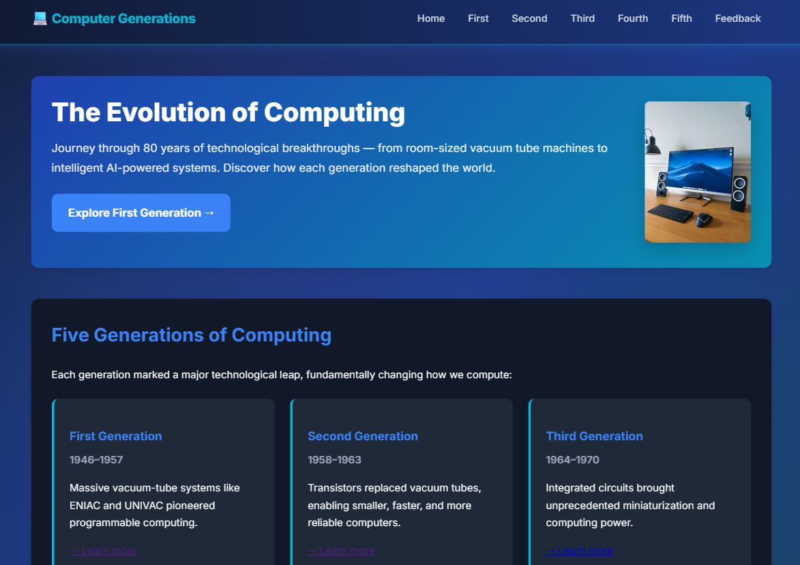

# Computer Generations — Evolution of Technology

A simple and responsive educational website that explores the **five generations of computers**, from early vacuum-tube machines to modern AI-powered and emerging computing technologies.

## About the Project

**Computer Generations** is an academic web project designed to present the history and evolution of computer technology in an easy-to-understand format.

The website covers:

* First Generation — Vacuum Tubes
* Second Generation — Transistors
* Third Generation — Integrated Circuits
* Fourth Generation — Microprocessors
* Fifth Generation — Artificial Intelligence and Future Technologies

It also highlights important milestones in hardware, software, and the global impact of computing.

## Features

* Information about all five computer generations
* Navigation between individual generation pages
* Clean and modern user interface
* Responsive design for different screen sizes
* Images and visual content
* Feedback page
* Easy navigation throughout the website
* Suitable for academic and educational use

## Project Structure

```text
Computer-Generations/
│
├── index.html
├── first.html
├── sec.html
├── third.html
├── forth.html
├── fifth.html
├── feedback.html
│
├── assets/
│   └── css/
│       └── style.css
│
├── images/
│   └── img1.jpeg
│
└── README.md
```

## Pages

| Page            | Description                    |
| --------------- | ------------------------------ |
| `index.html`    | Homepage and introduction      |
| `first.html`    | First generation of computers  |
| `sec.html`      | Second generation of computers |
| `third.html`    | Third generation of computers  |
| `forth.html`    | Fourth generation of computers |
| `fifth.html`    | Fifth generation of computers  |
| `feedback.html` | User feedback page             |

## Five Generations

### 1. First Generation — 1946–1957

The first generation used **vacuum tubes** for processing. Computers from this period were extremely large and consumed significant amounts of electricity.

Examples include **ENIAC** and **UNIVAC**.

### 2. Second Generation — 1958–1963

**Transistors** replaced vacuum tubes, making computers smaller, faster, more reliable, and more energy efficient.

### 3. Third Generation — 1964–1970

The introduction of **integrated circuits (ICs)** allowed multiple electronic components to be placed on a single chip, greatly improving computer performance and reducing size.

### 4. Fourth Generation — 1971–Present

The invention of the **microprocessor** led to personal computers and helped establish the modern digital era.

This generation also saw the rapid growth of networking, the internet, laptops, smartphones, and other digital technologies.

### 5. Fifth Generation — Now & Beyond

The fifth generation focuses on technologies such as:

* Artificial Intelligence
* Quantum Computing
* Nanotechnology
* Intelligent Computing Systems
* Emerging Technologies

## Technologies Used

* **HTML5** — Website structure
* **CSS3** — Styling and responsive layout
* **Google Fonts** — Inter font family
* **Images** — Visual content for the website

## How to Run

1. Download or clone this repository.
2. Make sure the project folders and files remain in their original structure.
3. Open `index.html` in a web browser.
4. Use the navigation menu to explore the different generations.

No server or database is required.

## Project Objectives

The main objectives of this project are to:

* Understand the evolution of computer technology.
* Learn about major hardware developments.
* Explore the progression of computer generations.
* Understand the impact of computers on modern society.
* Practice creating a multi-page website using HTML and CSS.

## Website Preview

The homepage introduces visitors to the evolution of computing and provides navigation to each generation.



## Academic Project

This website was created as an **academic project** to demonstrate knowledge of web development and the history of computer technology.

**© 2024 Computer Generations — Academic Project**

## License

This project is intended for **educational and academic purposes**.
